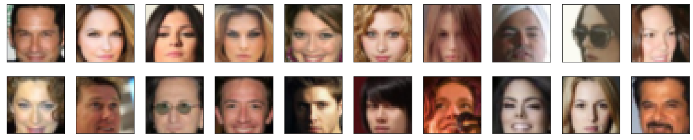
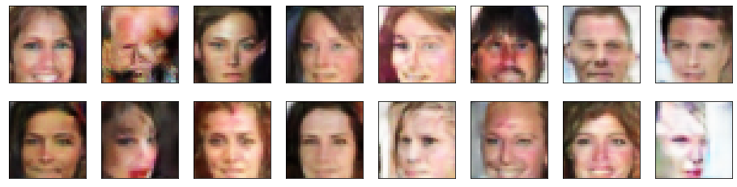

# Project: Train a DCGAN to generate human faces

In this project we implement a Deep Convolution Generative Adversarial Network (DCGAN) and train it to generate human faces. The training dataset was created by cropping faces from images in the [celebA](http://mmlab.ie.cuhk.edu.hk/projects/CelebA.html) dataset and scaling them to a 32 x 32 size. The pixel values were scaled to lie between -1 and 1. 

# GAN Architecture:
We follow the canonical DCGAN architechture as described in the paper [UNSUPERVISED REPRESENTATION LEARNING WITH DEEP CONVOLUTIONAL GENERATIVE ADVERSARIAL NETWORKS](https://arxiv.org/pdf/1511.06434.pdf) by Radford et. al. It consists of two adversarial networks: the generator and the discriminator. 

According to Radford et. al.,  it is helpful to follow the following guidelines for stable Deep Convolutional GANs:
 - Replace any pooling layers with strided convolutions (discriminator) and fractional-strided
convolutions (generator).
 
 - Use batchnorm in both the generator and the discriminator.
 - Remove fully connected hidden layers for deeper architectures.
 - Use ReLU activation in generator for all layers except for the output, which uses Tanh.
 - Use LeakyReLU activation in the discriminator for all layers

## The Generator:
The generator takes a vector of random values as input and learns to generate a (3,32,32) image of a human face corresponding to the input vector. It consists of 3 transpose convolutional layers. The input vector is first passed through a fully connected linear layer whose output is reshaped to form an array of size (128, 4, 4,). This is then passed through the transpose Convolutional layers which successively upsample it to finally output a (3,32,32) image as follows:
```(128, 4 , 4) -> (64, 8 , 8) -> (32, 16 , 16) -> (3, 32, 32)``` .

All the transpose convolutional layers have a kernel of size 4, a stride of size 2 and a padding of size 1. The first two transpose convolutional layers are each followed by a batchnorm layer and have a ReLU activation. The final transpose convolutional layer has no batchnorm and a tanh activation.   

## The Discriminator:
The dicriminator takes a (3,32,32) image as input and outputs a score to decide if the image is a real image or a fake image produced by the generator of our GAN. It is a [Fully Convolutional Network (FCN)](https://arxiv.org/abs/1411.4038). It consists of 4 convolutional layers . Each of these has a kernel of size 4. 

As the image passes through the convolutional layer, its size gets transformed as follows:
```(3,32,32) -> (32, 16, 16) -> (64, 8, 8) -> (128, 4, 4) -> (1,1,1) ```

The first three convolutional layers have a stride of 2 and padding of size 1. Each of these is followed by a batchnorm layer and have a Leaky_ReLU activation. The final convolutional layer acts act the output layer of the dicriminator. It has a stride 1, no padding and no batchnorm. 

# Training

We trained the GAN for 500 epochs with the [Adam](https://arxiv.org/abs/1412.6980) optimizer at a learning rate lr = 0.0002 along with momentum terms beta1 = 0.5 and beta2 = 0.999.

# Sample of Traning images
Following  are some of the images that were used to train the GAN:



# Sample of Generated images
Following are a sample of faces generated by our trained GAN:



There are a couple of interesting things to notice about the samples produced by our GAN:

1) Though the model was able to learn how to generate faces, the images so generated are quite low resolution and still far from being as good as the real images used during training.

2) Many of the faces are not fully formed (for e.g. the 2nd and the 3rd images from left in the first row of the sample images above). This can be perhaps attributed to two things: 
  
  -  The model itself is quite simple and therefore fails to learn a better representation of the faces 
  
  - The training images themselves do not always contain an absolutely clear view of the face which is at times partially obstructed by hands, microphones and other objects that might be present in the scene (for example the 1st image from left in the first row of images displayed [here](#sample-of-traning-images).

3) Another important thing to notice is that for the current task, the training images had to be cropped so as to keep only the face in the picture and remove anything else. This involves a lot of preprocessing time plus removes any information about the background scene. Thus the images generated by the GAN also do not have a natural looking background which usually seems to be either dark or white, resembling a passport picture rather than a picture taken in a natural setting.


4) Almost all the faces seem to belong to white people. This clearly due to the bias towards white celebraties in the training dataset itself. 

The first three issues mentioned above can be greatly alleviated by using a deeper more complicated model such as the style-GAN proposed in [this](https://arxiv.org/pdf/1812.04948.pdf) paper. For example the images generated by a styel-GAN seem to have a much more interesting background. The last issue can obviously be cured by collecting training images that span over a much more varied demographic.